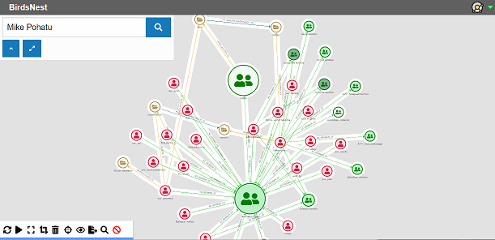

# BirdsNest  

BirdsNest is designed to help visually explore and make sense the connections between systems and objects within your environment. 

Data is ingested into a [neo4j](https://neo4j.com/ "neo4j") graph database by system-specific scanners, reading the system's connections and adding them into the wider birds nest (see where we got the name from?) of interconnected data from everything else in your environment. 

The BirdsNest console then allows you to explore and query all the interconnected data in a visual way, finding pathways that are not obvious or easily discovered. You can either start from a single node and discover interconnections as you go, or search for a specific type of path through your data. 

[Visualizer First Steps](/documentation/intro/visualizer-first-steps.md "Visualizer First Steps")\
[Simple Search](/documentation/simple-search/overview.md "Simple Search")\
[Advanced Search](/documentation/advanced-search/overview.md "Advanced Search")